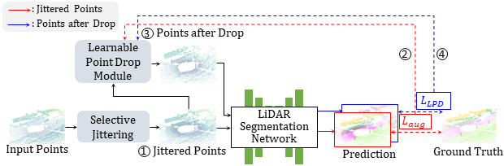
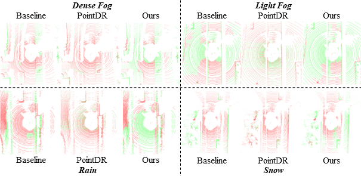

<div style="text-align: center;">
  <h1>[ECCV 2024 Oral] Rethinking Data Augmentation for Robust LiDAR Semantic Segmentation in Adverse Weather</h1>

  <b>Junsung Park, Kyungmin Kim, Hyunjung Shim</b><br>
  CVML Lab. KAIST AI.<br>

  <a href="https://paperswithcode.com/sota/lidar-semantic-segmentation-on-semanticstf?p=rethinking-data-augmentation-for-robust-lidar">
    
  </a>
  <br>
  <a href="https://arxiv.org/abs/2407.02286">
    
  </a>
  <br>
  <a href="https://engineerjpark.github.io/ECCV2024LiDARWeather" target='_blank'>
   [Project Page]
  </a>
</div>


## About

Official implementation of "Rethinking Data Augmentation for Robust LiDAR Semantic Segmentation in Adverse Weather", accepted in ECCV 2024.

Existing LiDAR semantic segmentation methods often struggle in adverse weather conditions. Previous work has addressed this by simulating adverse weather or using general data augmentation, but lacks detailed analysis of the negative effects on performance. We identified key factors of adverse weather affecting performance: geometric perturbation from refraction and point drop due to energy absorption and occlusions. Based on these findings, we propose new data augmentation techniques: Selective Jittering (SJ) to mimic geometric perturbation and Learnable Point Drop (LPD) to approximate point drop patterns using a Deep Q-Learning Network. These techniques enhance the model by exposing it to identified vulnerabilities without precise weather simulation.


<br>
<p align="center">
  
  <br>
  Fig. The overall training process of our methods.
</p>
<br>

## Updates

- \[2024.09\] - Our paper is selected as **ORAL PRESENTATION** in ECCV 2024! [Link](https://eccv2024.ecva.net/virtual/2024/oral/884)
- \[2024.08\] - Our project page is opened! Check it out in <a href="https://engineerjpark.github.io/ECCV2024LiDARWeather" target='_blank'>here!</a>
- \[2024.08\] - Official implementation is released! Also, our paper is available on arXiv, click <a href="https://arxiv.org/abs/2407.02286" target='_blank'>here</a> to check it out.


## Contents

- [Installation](#installation)
- [Data Preparation](#data-preparation)
- [Getting Started](#getting-started)
- [Main Results](#main-results)
- [License](#license)
- [Acknowledgement](#acknowledgement)
- [Citation](#citation)


## Installation
```Shell
conda create -n lidar_weather python=3.8 -y && conda activate lidar_weather
conda install pytorch==1.10.0 torchvision==0.11.0 cudatoolkit=11.3 -c pytorch -y
pip install -U openmim && mim install mmengine && mim install 'mmcv>=2.0.0rc4, <2.1.0' && mim install 'mmdet>=3.0.0, <3.2.0'

git clone https://github.com/engineerJPark/LiDARWeather.git
cd LiDARWeather && pip install -v -e .

pip install cumm-cu113 && pip install spconv-cu113
sudo apt-get install libsparsehash-dev
export PATH=/usr/local/cuda/bin:$PATH && pip install --upgrade git+https://github.com/mit-han-lab/torchsparse.git@v1.4.0
pip install nuscenes-devkit
pip install wandb
```

Please refer to [INSTALL.md](docs/INSTALL.md) for the installation details.


## Data Preparation
Please refer to [DATA_PREPARE.md](docs/DATA_PREPARE.md) for the details to prepare the <sup>1</sup>[SemanticKITTI](http://www.semantic-kitti.org/), <sup>2</sup>[SynLiDAR](https://github.com/xiaoaoran/SynLiDAR), <sup>3</sup>[SemanticSTF](https://github.com/xiaoaoran/SemanticSTF), and <sup>4</sup>[SemanticKITTI-C](https://github.com/ldkong1205/Robo3D) datasets.


## Getting Started

### Train
```python
./tools/dist_train.sh configs/lidarweather_minkunet/sj+lpd+minkunet_semantickitti.py 4

./tools/dist_train.sh projects/CENet/lidarweather_cenet/sj+lpd+cenet_semantickitti.py 4
```

### Test
```python
python tools/test.py configs/lidarweather_minkunet/sj+lpd+minkunet_semantickitti.py work_dirs/sj+lpd+minkunet_semantickitti/epoch_15.pth

python tools/test.py projects/CENet/lidarweather_cenet/sj+lpd+cenet_semantickitti.py work_dirs/sj+lpd+cenet_semantickitti/epoch_50.pth
```

Please refer to [GET_STARTED.md](docs/GET_STARTED.md) to learn more details.


## Main Results
### SemanticKITTI &rarr; SemanticSTF
<table>
   <tr>
      <th>Methods</th>
      <th><small><div style="transform: rotate(90deg);">D-fog</div></small></th>
      <th><small><div style="transform: rotate(90deg);">L-fog</div></small></th>
      <th><small><div style="transform: rotate(90deg);">Rain</div></small></th>
      <th><small><div style="transform: rotate(90deg);">Snow</div></small></th>
      <th>mIoU</th>
   </tr>
   <tr>
      <td><small>Oracle</small></td>
      <td><small>51.9</small></td>
      <td><small>54.6</small></td>
      <td><small>57.9</small></td>
      <td><small>53.7</small></td>
      <td><small>54.7</small></td>
   </tr>
   <tr>
      <td><small>Baseline</small></td>
      <td><small>30.7</small></td>
      <td><small>30.1</small></td>
      <td><small>29.7</small></td>
      <td><small>25.3</small></td>
      <td><small>31.4</small></td>
   </tr>
   <tr>
      <td><small>LaserMix</td>
      <td><small>23.2</small></td>
      <td><small>15.5</small></td>
      <td><small>9.3</small></td>
      <td><small>7.8</small></td>
      <td><small>14.7</small></td>
   </tr>
   <tr>
      <td><small>PolarMix</td>
      <td><small>21.3</small></td>
      <td><small>14.9</small></td>
      <td><small>16.5</small></td>
      <td><small>9.3</small></td>
      <td><small>15.3</small></td>
   </tr>
   <tr>
      <td><small>PointDR<sup>*</sup></td>
      <td><small><strong>37.3</strong></small></td>
      <td><small><u>33.5</u></small></td>
      <td><small><u>35.5</u></small></td>
      <td><small><u>26.9</u></small></td>
      <td><small><u>33.9</u></small></td>
   </tr>
   <tr>
      <td><small>Baseline+SJ+LPD</td>
      <td><small><u>36.0</u></small></td>
      <td><small><strong>37.5</strong></small></td>
      <td><small><strong>37.6</strong></small></td>
      <td><small><strong>33.1</strong></small></td>
      <td><small><strong>39.5</strong></small></td>
   </tr>
   <tr>
      <td><small><span style="color:red;">Increments to baseline</span></small></td>
      <td><small><span style="color:red;">+5.3</span></small></td>
      <td><small><span style="color:red;">+7.4</span></small></td>
      <td><small><span style="color:red;">+7.9</span></small></td>
      <td><small><span style="color:red;">+7.8</span></small></td>
      <td><small><span style="color:red;">+8.1</span></small></td>
   </tr>
</table>

### SynLiDAR &rarr; SemanticSTF
<table>
   <tr>
      <th>Methods</th>
      <th><small><div style="transform: rotate(90deg);">D-fog</div></small></th>
      <th><small><div style="transform: rotate(90deg);">L-fog</div></small></th>
      <th><small><div style="transform: rotate(90deg);">Rain</div></small></th>
      <th><small><div style="transform: rotate(90deg);">Snow</div></small></th>
      <th>mIoU</th>
   </tr>
   <tr>
      <td><small>Oracle</small></td>
      <td><small>51.9</small></td>
      <td><small>54.6</small></td>
      <td><small>57.9</small></td>
      <td><small>53.7</small></td>
      <td><small>54.7</small></td>
   </tr>
   <tr>
      <td><small>Baseline</small></td>
      <td><small>15.24</small></td>
      <td><small>15.97</small></td>
      <td><small>16.83</small></td>
      <td><small>12.76</small></td>
      <td><small>15.45</small></td>
   </tr>
   <tr>
      <td><small>LaserMix</td>
      <td><small>15.32</small></td>
      <td><small>17.95</small></td>
      <td><small>18.55</small></td>
      <td><small>13.8</small></td>
      <td><small>16.85</small></td>
   </tr>
   <tr>
      <td><small>PolarMix</td>
      <td><small>16.47</small></td>
      <td><small>18.69</small></td>
      <td><small>19.63</small></td>
      <td><small>15.98</small></td>
      <td><small>18.09</small></td>
   </tr>
   <tr>
      <td><small>PointDR<sup>*</sup></td>
      <td><small><u>19.09</u></small></td>
      <td><small>20.28</small></td>
      <td><small><u>25.29</u></small></td>
      <td><small><u>18.98</u></small></td>
      <td><small>19.78</small></td>
   </tr>
   <tr>
      <td><small>Baseline+SJ+LPD</small></td>
      <td><small>19.08</small></td>
      <td><small>20.65</small></td>
      <td><small>21.97</small></td>
      <td><small>17.27</small></td>
      <td><small>20.08</small></td>
   </tr>
   <tr>
      <td><small><span style="color:red;">Increments to baseline</span></small></td>
      <td><small><span style="color:red;">+3.8</span></small></td>
      <td><small><span style="color:red;">+4.7</span></small></td>
      <td><small><span style="color:red;">+5.1</span></small></td>
      <td><small><span style="color:red;">+4.5</span></small></td>
      <td><small><span style="color:red;">+4.6</span></small></td>
   </tr>
</table>

### Other Models \& Dataset
<table>
   <tr>
      <th>Method</th>
      <th>SemanticSTF</th>
      <th>SemanticKITTI-C</th>
   </tr>
   <tr>
      <td>CENet</td>
      <td>14.2</td>
      <td>49.3</td>
   </tr>
   <tr>
      <td>CENet+Ours</td>
      <td>22.0 <span style="color:red;">(+7.8)</span></td>
      <td>53.2 <span style="color:red;">(+3.9)</span></td>
   </tr>
   <tr>
      <td>SPVCNN</td>
      <td>28.1</td>
      <td>52.5</td>
   </tr>
   <tr>
      <td>SPVCNN+Ours</td>
      <td>38.4 <span style="color:red;">(+10.3)</span></td>
      <td>52.9 <span style="color:red;">(+0.4)</span></td>
   </tr>
   <tr>
      <td>Minkowski</td>
      <td>31.4</td>
      <td>53.0</td>
   </tr>
   <tr>
      <td>Minkowski+Ours</td>
      <td>39.5 <span style="color:red;">(+8.1)</span></td>
      <td>58.6 <span style="color:red;">(+5.6)</span></td>
   </tr>
</table>


## Qualitative Results

<br>
<p align="center">
  
  <br>
  Fig. Qualitative results of our methods.
</p>
<br>


## License
<a rel="license" href="http://creativecommons.org/licenses/by-nc-nd/4.0/"></a>
<br />
This work is under the <a rel="license" href="http://creativecommons.org/licenses/by-nc-nd/4.0/">Creative Commons Attribution-NonCommercial-NoDerivatives 4.0 International License</a>.


## Acknowledgement

<br>

Our codebase builds heavily on [MMDetection3D](https://github.com/open-mmlab/mmdetection3d) and [PyTorch DQN Tutorials](https://pytorch.org/tutorials/intermediate/reinforcement_q_learning.html).  MMDetection3D is an open-source toolbox based on PyTorch, towards the next-generation platform for general 3D perception. It is a part of the OpenMMLab project developed by MMLab.

## Citation

If you find this work helpful, please kindly consider citing our paper:

```bibtex
@article{park2024rethinking,
  title={Rethinking Data Augmentation for Robust LiDAR Semantic Segmentation in Adverse Weather},
  author={Park, Junsung and Kim, Kyungmin and Shim, Hyunjung},
  journal={arXiv preprint arXiv:2407.02286},
  year={2024}
}
```

This citation will be updated after the proceedings are published.
